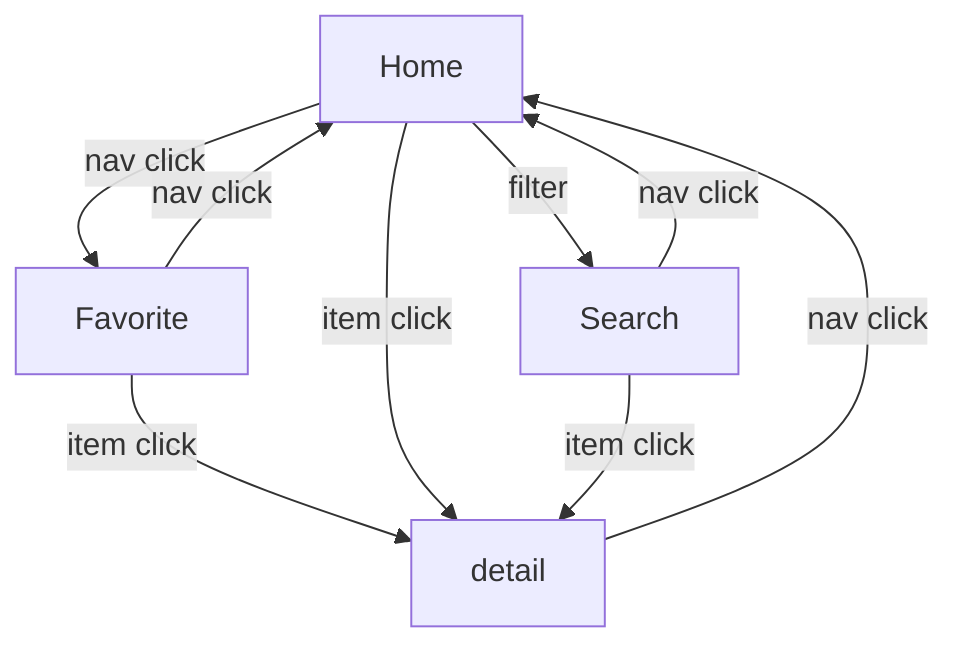

# Charity Finder

this is a frontend application to find the charity from an api and save it to favorite list stored on localstorage.

## live demo

[live demo](https://glittery-semifreddo-083a25.netlify.app)

## motivation

this is a homework

# objective

to complete the homework

# specification

## prerequsite

-   nodejs installed
-   npm installed

## getting started

```sh
git clone
npm install
npm run dev
```

this will start a development server running on http://localhost:5173

## sitemap



## api used

-   ` https://partners.every.org/v0.2/nonprofit/${identifier}?apiKey=${env.VITE_API_KEY}`
    -   to query the detail of charity organization
-   `https://partners.every.org/v0.2/browse/${cause}?apiKey=${env.VITE_API_KEY}${take > 0 ? '&take=${take}' : ""}`
    -   to query the list of charity organization from giver cause

## difficulties

-   when trying to call the api CORS block was appear when I tried to use Axios. this does not happen when I develop my own backend, since I always handle CORS on the backend. After drilling into it, Axios uses XMLHttprequest which will trigger browser to send a Preflight OPTION request to server. Since most server did not handle OPTION, preflight will fail and will block for sure. The resolution is not to use Axios, use Fetch instead, fetch uses newer Request object under the hood which contains mode option that supports cors request.

## others

<details>
<summary>React + Typescript + Vite README</summary>

# React + TypeScript + Vite

This template provides a minimal setup to get React working in Vite with HMR and some ESLint rules.

Currently, two official plugins are available:

-   [@vitejs/plugin-react](https://github.com/vitejs/vite-plugin-react/blob/main/packages/plugin-react/README.md) uses [Babel](https://babeljs.io/) for Fast Refresh
-   [@vitejs/plugin-react-swc](https://github.com/vitejs/vite-plugin-react-swc) uses [SWC](https://swc.rs/) for Fast Refresh

## Expanding the ESLint configuration

If you are developing a production application, we recommend updating the configuration to enable type aware lint rules:

-   Configure the top-level `parserOptions` property like this:

```js
   parserOptions: {
    ecmaVersion: 'latest',
    sourceType: 'module',
    project: ['./tsconfig.json', './tsconfig.node.json'],
    tsconfigRootDir: __dirname,
   },
```

-   Replace `plugin:@typescript-eslint/recommended` to `plugin:@typescript-eslint/recommended-type-checked` or `plugin:@typescript-eslint/strict-type-checked`
-   Optionally add `plugin:@typescript-eslint/stylistic-type-checked`
-   Install [eslint-plugin-react](https://github.com/jsx-eslint/eslint-plugin-react) and add `plugin:react/recommended` & `plugin:react/jsx-runtime` to the `extends` list
</details
